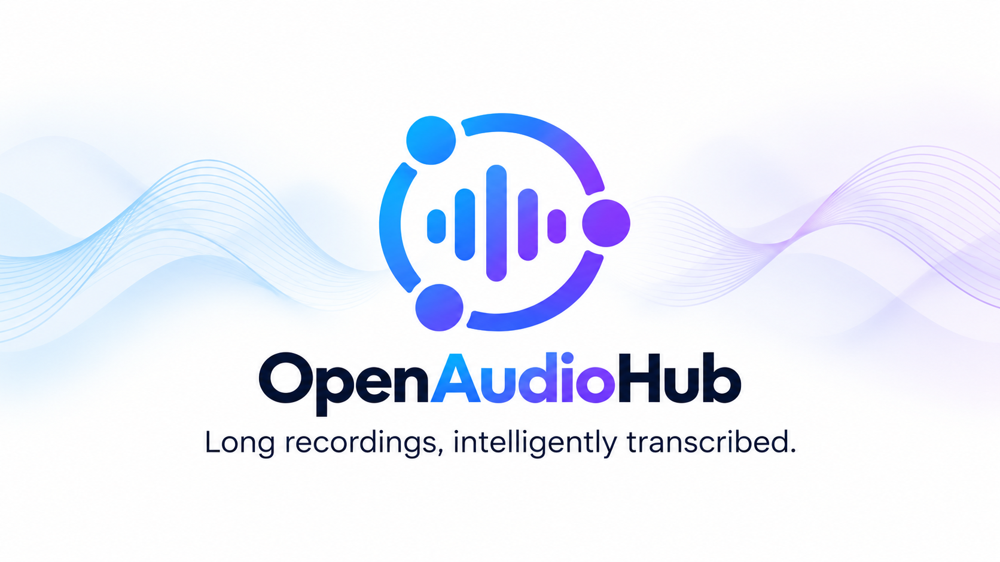
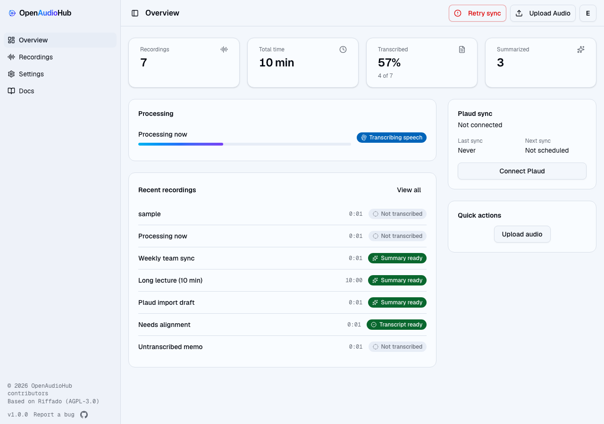
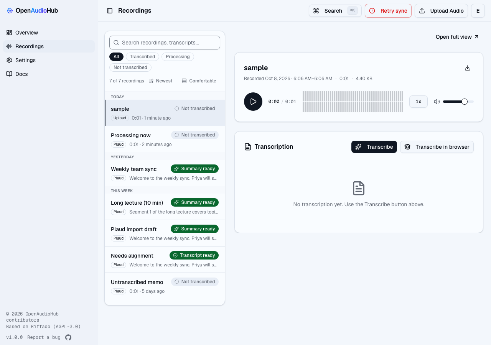
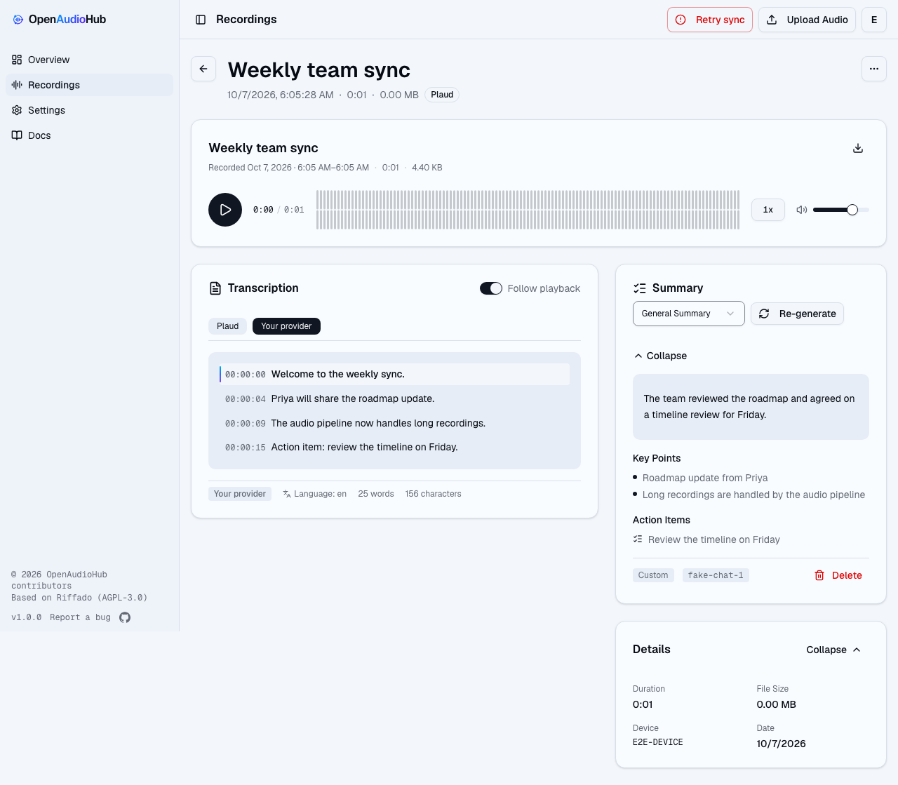
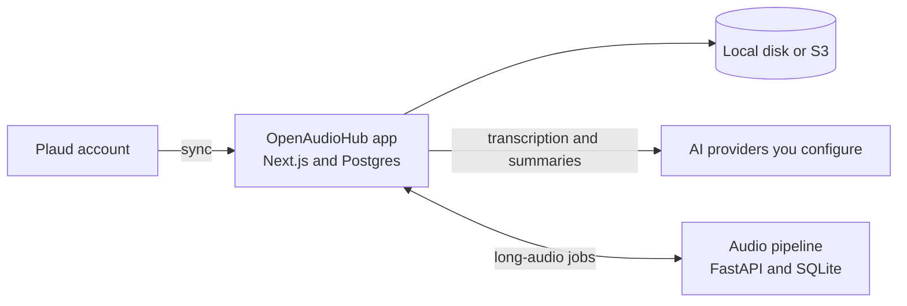

<p align="center">
  
</p>

# OpenAudioHub

**Long recordings, intelligently transcribed.**

OpenAudioHub is a self-hosted web app for Plaud recordings. It syncs your recordings from your Plaud account, keeps the audio on storage you control, and produces transcripts and summaries with AI providers you choose. An optional audio pipeline prepares long recordings and processes them in durable, resumable chunks. When you decide to leave, you can export everything.

[](LICENSE)

[Quick start](#quick-start) · [Features](#features) · [Configuration](#configuration) · [Documentation](#documentation) · [Attribution](#attribution)

OpenAudioHub is self-hosted software. This project does not operate a hosted service.

## Features

- **Plaud sync.** A background worker and open browser tabs pull new recordings from your Plaud account. Sync is idempotent, so an interrupted run resumes without creating duplicates. Plaud Note, Note Pro, and NotePin are supported.
- **Transcription with the providers you choose.** OpenAI, Groq, OpenRouter, Together AI, Google Gemini, ElevenLabs Scribe with speaker labels, LM Studio, Ollama, and any other OpenAI-compatible endpoint. Browser transcription runs Whisper on your device and needs no API key.
- **Summaries.** Built-in and custom prompts, a provider choice for each recording, and optional summaries generated automatically after transcription.
- **Long-audio pipeline (optional).** Speech is detected locally with Silero VAD, long silences are skipped, and the audio is processed in chunks. Jobs keep checkpoints, support retry and cancellation, and resume after a restart. Transcript segments link back to the original audio.
- **Your storage.** Audio can live on the local filesystem or in any S3-compatible bucket, including AWS S3, Cloudflare R2, MinIO, and Backblaze B2.
- **Notifications.** Bark for iOS push, browser notifications, and email over SMTP.
- **Automation.** Read-only personal API keys for `/api/v1`, and webhook deliveries signed with HMAC-SHA256.
- **Export.** A full-data ZIP with audio, transcripts, summaries, and a manifest. Transcripts can also be exported as JSON, TXT, SRT, or VTT.
- **Encryption at rest.** Transcripts, summaries, titles, prompts, provider keys, and Plaud tokens are encrypted with AES-256-GCM under a key you hold.

## Screenshots

The overview, the recording library, and a recording with its transcript and summary, at a 1280 px width in light mode.

| Overview | Library | Recording |
| --- | --- | --- |
|  |  |  |

## Architecture



The app is one Next.js process backed by Postgres. The audio pipeline is a separate service that is reachable only on the Compose network. It prepares long recordings and keeps their checkpoints. The app holds the AI provider credentials, makes every provider request, and encrypts the transcripts and timelines it stores. [docs/audio-pipeline.md](docs/audio-pipeline.md) describes the pipeline in detail.

## Quick start

You need Docker with Compose v2, a Plaud account, and either an AI provider key or a local model server such as Ollama or LM Studio. Browser transcription needs neither.

### One-line installer

This installs the latest release into `$HOME/openaudiohub`, generates the secrets, and starts the stack:

```bash
curl -fsSL https://github.com/JeremyL691/OpenAudioHub/releases/latest/download/install.sh | sh
```

### From a checkout

```bash
git clone https://github.com/JeremyL691/OpenAudioHub.git
cd OpenAudioHub
cp .env.example .env
```

Set these values in `.env`. Generate each secret separately with `openssl rand -hex 32`.

| Variable | Value |
| --- | --- |
| `POSTGRES_PASSWORD` | A random password for the bundled database |
| `BETTER_AUTH_SECRET` | A random secret, at least 32 characters |
| `ENCRYPTION_KEY` | A random 64-character hex key |
| `AUDIO_PIPELINE_TOKEN` | A random token, at least 32 characters |
| `APP_URL` | `http://localhost:3000` for a local installation |

Start the stack:

```bash
docker compose up -d
```

Open [http://localhost:3000](http://localhost:3000), create an account, connect your Plaud account, and choose a transcription provider in Settings.

To build the image from this checkout instead of pulling the published one:

```bash
docker compose -f docker-compose.yml -f docker-compose.dev.yml up -d --build
```

## Configuration

Set variables in `.env`. The complete reference is in the app at `/docs/self-hosting/environment-variables`. These are the values most installations change:

| Variable | Purpose |
| --- | --- |
| `OPENAUDIOHUB_VERSION` | Image tag to run. Defaults to `latest`. Pin an exact version for reproducible installs. |
| `DEFAULT_STORAGE_TYPE` | `local` (default) or `s3`. The storage backend applies to the whole instance. |
| `S3_ENDPOINT`, `S3_BUCKET`, `S3_REGION`, `S3_ACCESS_KEY_ID`, `S3_SECRET_ACCESS_KEY` | S3-compatible storage settings. |
| `SMTP_HOST`, `SMTP_PORT`, `SMTP_SECURE`, `SMTP_USER`, `SMTP_PASSWORD`, `SMTP_FROM` | Outbound email for notifications. |
| `DISABLE_REGISTRATION` | Set to `true` to close sign-up after the accounts you need exist. |
| `BACKGROUND_SYNC_ENABLED` | Set to `false` to sync only while the app is open. |

Keep `ENCRYPTION_KEY` in a safe place, separate from the database backup. Encrypted content cannot be recovered without it. Changing `POSTGRES_PASSWORD` in `.env` does not change a database that already exists. [docs/DEPLOYMENT.md](docs/DEPLOYMENT.md) covers rotation and production setup.

## Upgrading an existing installation

If you run an earlier installation, read [docs/MIGRATION_FROM_RIFFADO.md](docs/MIGRATION_FROM_RIFFADO.md) before you change anything. It lists the renamed webhook headers, the Compose project and database names, the renamed environment variables, and the required upgrade order for the audio pipeline.

## Documentation

- In the app at `/docs`. The source is in [content/docs](content/docs). It covers installation, configuration, AI providers, notifications, automation, backup, and the public API.
- [docs/DEPLOYMENT.md](docs/DEPLOYMENT.md): production deployment, reverse proxies, and backups.
- [docs/API.md](docs/API.md): the public `/api/v1` surface and webhooks.
- [docs/AUTO_SYNC.md](docs/AUTO_SYNC.md): how recordings are synced.
- [docs/audio-pipeline.md](docs/audio-pipeline.md) and [docs/audio-pipeline-operations.md](docs/audio-pipeline-operations.md): the long-audio pipeline and its backup, restore, and repair runbook.
- [docs/encryption-at-rest.md](docs/encryption-at-rest.md) and [docs/error-codes.md](docs/error-codes.md).
- [CONTRIBUTING.md](CONTRIBUTING.md), [SECURITY.md](SECURITY.md), [BRANCHING.md](BRANCHING.md), and [CHANGELOG.md](CHANGELOG.md).

## Development

```bash
pnpm install --frozen-lockfile
pnpm dev
pnpm format-and-lint
pnpm type-check
pnpm test
pnpm e2e

cd audio-pipeline
uv run --frozen --group dev ruff check src tests
uv run --frozen --group dev pytest
```

[CONTRIBUTING.md](CONTRIBUTING.md) describes the workflow. [docs/DEVELOPMENT.md](docs/DEVELOPMENT.md) describes the local setup.

## Scope and limits

- OpenAudioHub is self-hosted only. Plaud is the only supported recorder family today.
- Audio and transcripts are sent in plaintext to the AI provider you configure. A local provider such as Ollama or LM Studio keeps them on your own machine.
- The audio pipeline accepts recordings up to 24 hours. That limit is enforced. Long-run endurance, accuracy, and cost have not been benchmarked yet.
- Timestamp positioning depends on the model. Gemini and chat-style transcription save text without a timeline.
- OpenAudioHub does not claim HIPAA, SOC 2, or any other compliance certification. Those depend on your provider and your deployment.

## License

OpenAudioHub is licensed under the [GNU Affero General Public License v3.0](LICENSE). If you run a modified version as a network service, you must make its source available to the people who use it. [NOTICE](NOTICE) lists the third-party components and their licenses.

## Attribution

OpenAudioHub is based on Riffado v0.6.4 (commit `712e74f`), an AGPL-3.0 project created by Perier and maintained by the Riffado community. The long-audio pipeline was developed in a fork of Riffado. OpenAudioHub is maintained independently of the Riffado project.

OpenAudioHub is independent of Plaud Inc. and is not endorsed by Plaud. Device and service names are used only to describe interoperability.
