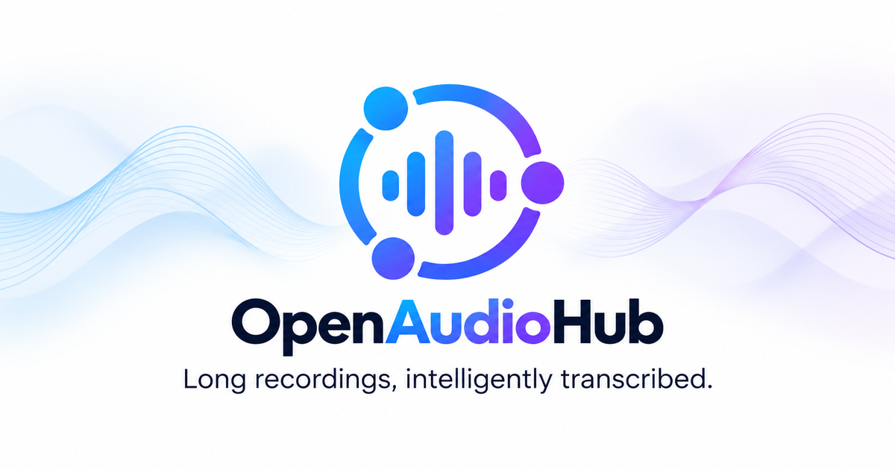
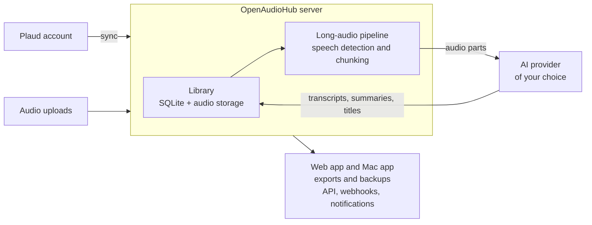

<p align="center">
  
</p>

<p align="center">
  <strong>A self-hosted server and Mac app for your Plaud recordings.</strong><br>
  Sync them, transcribe and summarize them with the AI providers you choose, and keep everything on infrastructure you control.
</p>

<p align="center">
  <a href="https://github.com/JeremyL691/OpenAudioHub/actions/workflows/ci.yml"></a>
  <a href="https://github.com/JeremyL691/OpenAudioHub/releases/latest"></a>
  <a href="#download-the-mac-app"></a>
  <a href="https://github.com/JeremyL691/OpenAudioHub/pkgs/container/openaudiohub"></a>
  <a href="LICENSE"></a>
</p>

<p align="center">
  <a href="#download-the-mac-app">Mac app</a> ·
  <a href="#self-hosting-quick-start">Self-hosting</a> ·
  <a href="docs/README.md">Documentation</a> ·
  <a href="docs/public-api.md">Public API</a> ·
  <a href="CHANGELOG.md">Changelog</a> ·
  <a href="https://github.com/JeremyL691/OpenAudioHub/discussions">Discussions</a>
</p>

## Why OpenAudioHub

<table>
  <tr>
    <td width="50%" valign="top">
      <h3>Your recordings, your storage</h3>
      Audio stays on your disk or in your own S3-compatible bucket. Titles, transcripts, summaries and tokens are encrypted at rest, and you can export everything at any time.
    </td>
    <td width="50%" valign="top">
      <h3>The AI provider you choose</h3>
      OpenAI, Google Gemini, ElevenLabs, Groq, OpenRouter, Ollama, LM Studio or any OpenAI-compatible service. Or transcribe in the browser with a Whisper model, with no audio sent anywhere.
    </td>
  </tr>
  <tr>
    <td width="50%" valign="top">
      <h3>Built for long recordings</h3>
      Speech detection splits hours of audio at natural pauses, transcribes the parts and joins them into one transcript. Finished parts are kept, so a retry picks up where it stopped.
    </td>
    <td width="50%" valign="top">
      <h3>A Mac app or one container</h3>
      Run it as a native app on an Apple Silicon Mac, or as a single container with one SQLite data volume. Both run the same server.
    </td>
  </tr>
</table>

## Screenshots

<table>
  <tr>
    <td width="50%"></td>
    <td width="50%"></td>
  </tr>
  <tr>
    <td align="center"><sub><b>Dashboard.</b> This week's totals, the latest recording and recent activity.</sub></td>
    <td align="center"><sub><b>Library.</b> Search, filters and collections, with a preview beside the list.</sub></td>
  </tr>
  <tr>
    <td width="50%"></td>
    <td width="50%"></td>
  </tr>
  <tr>
    <td align="center"><sub><b>Recording.</b> Transcript, summary and waveform playback on one page.</sub></td>
    <td align="center"><sub><b>Settings.</b> AI providers, summaries, Plaud, storage and backups.</sub></td>
  </tr>
</table>

## How it works


```mermaid
flowchart LR
    plaud["Plaud account"] -- sync --> server
    upload["Audio uploads"] --> server
    subgraph server["OpenAudioHub server"]
        direction TB
        library["Library<br/>SQLite + audio storage"] --> pipeline["Long-audio pipeline<br/>speech detection and chunking"]
    end
    pipeline -- "audio parts" --> ai["AI provider<br/>of your choice"]
    ai -- "transcripts, summaries, titles" --> library
    server --> out["Web app and Mac app<br/>exports and backups<br/>API, webhooks, notifications"]
```

Everything runs in one process: the HTTP API, the web app, the background workers and the audio pipeline. See [Architecture](docs/architecture.md) for the details.

## Features

- **Plaud sync.** Connect your Plaud account in the browser, with an email code or a pasted token. Sync runs by hand or in the background.
- **Transcription.** Presets for OpenAI, Google Gemini, ElevenLabs, Groq, Together AI, OpenRouter, SiliconFlow, OpenCode Go, LM Studio, Ollama and any OpenAI-compatible service. See [AI providers](docs/providers.md).
- **In-browser transcription.** Transcribe on your own device with a Whisper model, without sending audio to a provider.
- **Long recordings.** Speech detection splits long files into parts, transcribes them and joins the results.
- **Summaries and titles.** Summaries with key points and action items, and automatic titles, in the style you choose.
- **Library.** Search, collections, stars, merging, playback with a waveform, and keyboard shortcuts.
- **Export and backup.** Export recordings with their transcripts and summaries, create full backups, and schedule them.
- **Automation.** Personal API keys, a read-only public API, and signed webhooks with a delivery log.
- **Storage and privacy.** Keep audio on local disk or in an S3-compatible bucket. Titles, transcripts, summaries and tokens are encrypted at rest.
- **Notifications.** Email and Bark push when new recordings arrive.

## Download the Mac app

OpenAudioHub runs natively on Apple Silicon Macs (macOS 11 or later).

1. Download `OpenAudioHub_<version>_aarch64.dmg` from the [latest release](https://github.com/JeremyL691/OpenAudioHub/releases/latest).
2. Open the disk image and drag **OpenAudioHub** into your Applications folder.
3. Open the app. The app is ad-hoc signed and not notarized, so macOS blocks the first launch. Open **System Settings**, go to **Privacy & Security**, and choose **Open Anyway** next to the message about OpenAudioHub. Confirm, and the app opens.

Your library stays on your Mac, in `~/Library/Application Support/OpenAudioHub`. See the [Mac app guide](docs/desktop.md).

To check the download, compare its checksum with the matching line in `SHA256SUMS.txt` on the release page:

```sh
shasum -a 256 OpenAudioHub_*_aarch64.dmg
```

## Self-hosting quick start

You need Docker with Compose v2, and a domain name with an HTTPS reverse proxy for anyone who connects from outside your machine.

Install with one command. It downloads the compose file, creates the encryption key, starts the container and waits for the health check:

```sh
curl -fsSL https://github.com/JeremyL691/OpenAudioHub/releases/latest/download/install.sh | sh
```

To pin a release, set `OAH_VERSION` before the command, for example `OAH_VERSION=1.0.0`. The installer never overwrites an existing `.env`. To read the script before you run it, download [`install.sh`](deploy/install.sh) from the release first.

Or set it up by hand:

```sh
mkdir openaudiohub && cd openaudiohub
curl -fsSLO https://github.com/JeremyL691/OpenAudioHub/releases/latest/download/compose.yml
printf 'ENCRYPTION_KEY=%s\nAPP_URL=http://localhost:3000\n' "$(openssl rand -hex 32)" > .env
docker compose up -d
curl -fsS http://127.0.0.1:3000/api/health
```

Then open `http://localhost:3000/register` and create your account. Keep the `ENCRYPTION_KEY` in `.env` safe: without it, the encrypted data cannot be read. The container listens on `127.0.0.1` only. See the [self-hosting guide](docs/self-hosting.md) for the reverse proxy, backups and upgrades.

## Documentation

- [Documentation index](docs/README.md)
- Using OpenAudioHub: [library](docs/using-the-library.md), [connecting Plaud](docs/connect-plaud-account.md), [AI providers](docs/providers.md), [notifications](docs/notifications.md), [automation and webhooks](docs/automation-and-webhooks.md), [backup and restore](docs/backup-and-restore.md)
- Self-hosting: [install and operate](docs/self-hosting.md), [environment variables](docs/environment-variables.md), [S3-compatible storage](docs/storage-s3.md), [email (SMTP)](docs/email-smtp.md), [Mac app](docs/desktop.md)
- Reference: [public API](docs/public-api.md), [architecture](docs/architecture.md), [security model](docs/security-model.md), [encryption at rest](docs/encryption-at-rest.md)
- Behavior specification: [spec/](spec/README.md)

## Development

Prerequisites:

- Rust 1.85 or newer (edition 2024)
- Node.js 22 and pnpm, as set in the `packageManager` field of `web/package.json`
- `ffmpeg` and `ffprobe` on your `PATH`
- For the Mac app: macOS with the Xcode command line tools

Common commands:

```sh
cargo test -p oah                       # server tests
cargo clippy -p oah --all-targets -- -D warnings

cd web && pnpm install && pnpm build    # type checks, then builds the web app
cd contract-tests && pnpm install && cd ..
contract-tests/run.sh server            # builds the server and runs the contract suite
```

The full guide, including running the server locally and building the Mac app, is in [docs/development.md](docs/development.md).

## Project layout

| Path | Contents |
|---|---|
| [`crates/oah/`](crates/oah) | Server library and the `oah-server` binary (Rust, axum, SQLite) |
| [`web/`](web) | Web app (React, TypeScript, Vite, Tailwind) |
| [`desktop-tauri/`](desktop-tauri) | Mac app shell (Tauri 2) and the ffmpeg build script |
| [`contract-tests/`](contract-tests) | Playwright suite that checks the HTTP behavior against a running server |
| [`spec/`](spec) | Behavior specification that the server, web app and tests follow |
| [`docs/`](docs) | User, self-hosting and developer documentation |
| [`deploy/`](deploy) | Container image, compose file and installer |
| [`tools/`](tools) | Scripts that build the demo data and capture the screenshots |
| [`.github/`](.github) | CI, release workflow, issue and pull request templates |

## Contributing and security

- Read [CONTRIBUTING.md](CONTRIBUTING.md) before you open a pull request. It lists the checks to run and the commit message format.
- Report security problems privately, as described in [SECURITY.md](SECURITY.md).
- Everyone taking part is expected to follow the [Code of Conduct](CODE_OF_CONDUCT.md).

## License

OpenAudioHub is free software licensed under the [GNU Affero General Public License v3.0 only](LICENSE). See [NOTICE](NOTICE) for copyright notices and the licenses of bundled third-party components.

Plaud is a trademark of its owner. OpenAudioHub is an independent project and is not affiliated with or endorsed by Plaud Inc.
